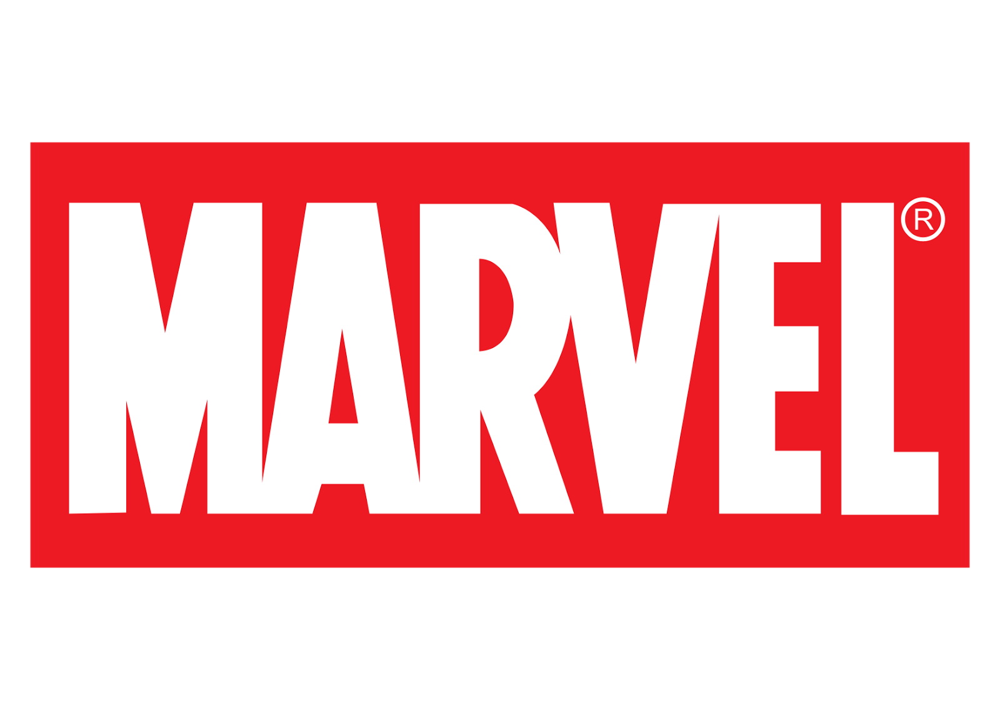
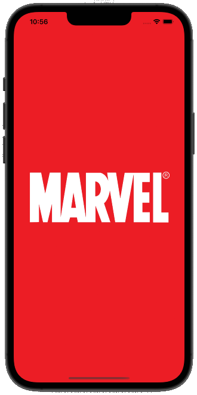
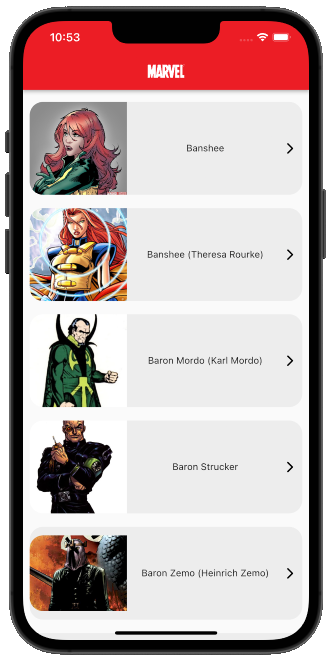
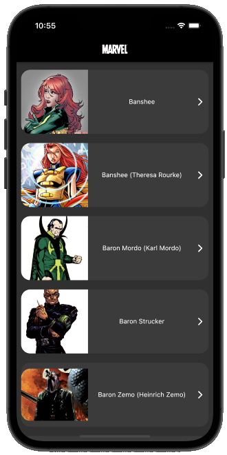
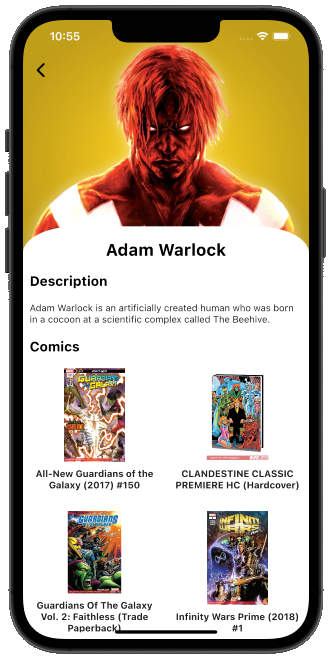
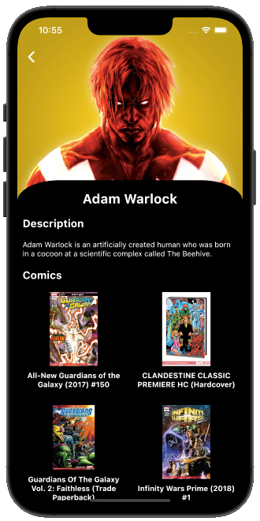

<!-- PROJECT LOGO -->
 

  

  <h1 align="center">Marvel Universe</h1>

  

    Marvel Universe is an application that introduces characters from marvel universe using marvel api.
  

<!-- TABLE OF CONTENTS -->

  
Table of Contents

  <ol>
    <li><a href="#built-with">Built With</a></li>
    <li><a href="#screenshots">Screenshots</a></li>
    <li><a href="#project-structure">Project Structure</a></li>
    <li><a href="#packages">Packages</a></li>
    <li><a href="#design-pattern">Design Pattern</a></li>
    <li><a href="#descriptions-of-project-files">Descriptions Of Project Files</a></li>
    <li><a href="#license">License</a></li>
    <li><a href="#contact">Contact</a></li>
  </ol>

## Built With

* [Flutter](https://flutter.dev/)
* [Dart](https://dart.dev/)
* [Marvel API](https://developer.marvel.com/docs)

## Screenshots

    
    
    
    
    

## Project Structure

<pre>
├── android
├── assets
│   ├── images
│   └── translations
├── ios
├── lib
│   ├── controller
│   ├── core
│   │   ├── constants
│   │   ├── extensions
│   │   ├── helper
│   │   ├── theme
│   │   └── utilities
│   ├── cubit
│   ├── model
│   ├── view
│   │   ├── not_found
│   │   └── home
│   │       ├── character_detail
│   │       └── characters
│   ├── main.dart
│   ├── splash_view.dart
├── pubspec.lock
└── pubspec.yaml
</pre>

## Packages

* Default Package
  * [cupertino_icons](https://pub.dev/packages/cupertino_icons/)
* Network Package
  * [dio](https://pub.dev/packages/dio/)
* State Management Package
  * [flutter_bloc](https://pub.dev/packages/flutter_bloc/)
* Presentation Packages
  * [font_awesome_flutter](https://pub.dev/packages/font_awesome_flutter/)
  * [page_transition](https://pub.dev/packages/page_transition/)
  * [shimmer](https://pub.dev/packages/shimmer/)
* Localization Package
  * [easy_localization](https://pub.dev/packages/easy_localization/)

## Design Pattern
The design pattern of the project is [MVC](https://en.wikipedia.org/wiki/Model–view–controller).

## Descriptions Of Project Files

<b>assets/ :</b>
  
This folder is the folder where the asset files of the project are located.

<b>assets/images/ :</b>
  
This folder is the folder where the image files of the project are located.

<b>assets/translations/ :</b>
  
This file is the file containing the translations files of the project.

<b>lib/ :</b>
  
It's the section where the source code of the project is located.

<b>lib/controller/ :</b>
  
It's the section that controls the business processes of the project.

<b>core/ :</b>
  
It's the section where the core folders of the project are located.

<b>core/constants/ :</b>
  
It's the section where the constants of the project are located.

<b>core/theme/ :</b>
  
It's the section where the theme of the project is located.

<b>core/utilities/ :</b>
  
It's the section where the custom widgets used throughout the project are located.

<b>cubit/ :</b>
  
It's the section where the state management of the project is located.

<b>model :</b>
  
It's the project section where the models of the data coming from the Marvel API are located.

<b>data/service :</b>
  
It's the part that communicates with the Marvel API.

<b>presentation/ :</b>
  
It's the presentation layer of the project.

  

## License

<pre>
MIT License

Copyright (c) 2022 MERT GÜVEN

Permission is hereby granted, free of charge, to any person obtaining a copy
of this software and associated documentation files (the "Software"), to deal
in the Software without restriction, including without limitation the rights
to use, copy, modify, merge, publish, distribute, sublicense, and/or sell
copies of the Software, and to permit persons to whom the Software is
furnished to do so, subject to the following conditions:

The above copyright notice and this permission notice shall be included in all
copies or substantial portions of the Software.

THE SOFTWARE IS PROVIDED "AS IS", WITHOUT WARRANTY OF ANY KIND, EXPRESS OR
IMPLIED, INCLUDING BUT NOT LIMITED TO THE WARRANTIES OF MERCHANTABILITY,
FITNESS FOR A PARTICULAR PURPOSE AND NONINFRINGEMENT. IN NO EVENT SHALL THE
AUTHORS OR COPYRIGHT HOLDERS BE LIABLE FOR ANY CLAIM, DAMAGES OR OTHER
LIABILITY, WHETHER IN AN ACTION OF CONTRACT, TORT OR OTHERWISE, ARISING FROM,
OUT OF OR IN CONNECTION WITH THE SOFTWARE OR THE USE OR OTHER DEALINGS IN THE
SOFTWARE.
</pre>

## Contact

* Mert Güven - [mertguven.com](http://mertguven.com/#/) - mertguven789@gmail.com

<a href="#top">⬆️</a>

